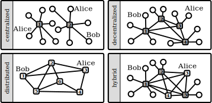

4. Which proposals has this movement for the degrowth perspective? (What is missing, which problems are out of the picture, what is underestimated, what themes, questions, problems aren't discussed at all or in an insufficient way?) Which proposals can the degrowth perspective offer to the movement?

Geschichtlich gesehen zählen zu den größten Beiträgen der Freien Software Bewegung die Produktion von digitalen Commons: Quellcodes, Daten, Informationen, Algorithmen und Wissen. Aber genauso zählt dazu auch die Entwicklung einer ganzen Kultur der Zusammenarbeit, die auf den Werten von Freiheit und Autonomie basieren und sich in dem bereits erwähnten gemeinschaftlich globalen Einsatz wie Wikipedia oder dem Linux Kernel materialisiert haben.
Auf der anderen Seite sehen wir aber auch, wie führende Konzerne frei verfügbare Software nutzen, um ihren Profit zu maximieren und eine weitere Konzentration auf ihre Anwendungen und Plattformen herbeizuführen.

Die Entwicklungen und neuen Produktions- und Konsumweisen, die durch sogenannten Share-Ökonomien unter Ausnutzung technologischer Plattformen vorrangebracht wurden, liefern uns ebenso interessante Einblicke in die Degrowth Debatte. Maurie Cohen (2015, eigene Übersetzung) veranschaulicht, anstatt die Austauschmuster der Sharing Economy sogleich zu verwerfen, dass ausformulierte "reziproke Beziehungen, Produzenten-Konsumenten Kooperativen die Absichten von Produktion und Konsumption gründlicher abzugleichen wissen". Die Herausforderung würde darin bestehen, eine "wirksamere Share Ökonomie" zu entwickeln, die in der Lage ist die "Ausbreitung von vermitteltem Mikro-Selbstunternehmertum und fortfolgender Vermietung zu Gunsten von Modi einvernehmlich gemeinschaffender Versorgung" einzuschränken.
Sie spricht von *Platform Cooperativism* als einen alternativen  instutionellen Rahmen, der diesen neue Mustern von Beziehungen, die auf Gegenseitigkeit basieren, und der Annäherung von Produzenten und Konsumenten zu einer sinnstiftenden gesellschaftlichen Wertigkeit verhelfen kann.

Diese sich immer weiter auflösenden Rollen von Produzenten und Konsumenten, die durch technikbasierte Lösungen mehr Möglichkeiten bekommen haben, führen zu einer Entstehung eines neues ökonomischen Typus, welchen der Zukunftsforscher Alvin Toffler als "Prosument" bezeichnet. Zur Entstehung dieses Typus tragen natürlich auch die gelebte Praxis der Share Ökonomie und eine weite Spannbreite von Sozialen Unternehmen bei. Kritiker merken aber an, dass dies ebenso dazu beitragen könnte, neue Formen der kapitalistischen Ausbeutung vorranzubringen, indem die Tendenz, unbezahlte Arbeit zu generieren, weiter verstärkt wird, während gleichzeitig Macht- und Entscheidungsstrukturen unberührt bleiben. (Ritzer and Jurgenson, 2010; Rogero, 2010)
Bauwens (2006) und Benkler and Nissenbaum (2006) argumentieren allerdings, dass die Peer Produktion ( deutscher Ausdruck?), die einer Logik von ( distributed?) peer-to-peer und commons-basierten peer Produktion folgt, unabhängig von der Marktlogik oder existierenden Machtstrukturen funktionieren kann.

Eine andere Debatte gibt es über die Architektur der Infrastruktur und der angebotenen Services ( Leistungen/dienstleistungen?)
Sollen wir sie komplett verteilte (?) Netzwerke haben ( peer-to-peer) oder besser dezentralisierte, verbündete und autonom kontrollierte? Während verteilte Technology interessante Perspektiven eröffnet, stellen sich genauso auch eine Reihe von Fragen, wenn diese Lösungen auf einem globalen Level stattfinden sollen ( z.B. mit automatisierenden verteilten Anlagenbüchern, die einen globalen Konsens darüber darstellen, wie Vertrauensverhältnisse über Transaktionen hergestellt werden können): Wer entscheidet über die verwendete Technologie der Distribution? Wie ist die Wahrung der Privatssphäre gesichert? Wie wird das Vertrauen der Menschen untereinander hergesellt, wenn es keine Institution oder Ort gibt, wo sie physisch greifbar gemacht werden kann, abgesehen von Algorithmen, die für die Transaktionen sorgen?

Unterstützer der Dezentralisation, wie z.B. der kollaborative Ansatz welcher vom *indieweb* praktiziert wird, verteidigen den verteilten Prozess gegenüber dem Konsens und fokussieren sich mehr auf der Willenskraft (?) der Hersteller als auf einer Automatisation aller Transaktionen. Der Mehraufwand (?), der bei verteilten Systemen auf der globalen Ebene erzeugt wird, wird als Nonsens angesehen:

"System werden sich niemals anpassen, wenn du nach einem globalen Konsens für lokale Aktionen fragst, die von unabhängigen Akteueren gemacht werden sollen. Zum Beispiel sollte ich nicht wissen müssen, wo jeder einzelne Dollar sich gerade in der Ökonomie befindet, wenn ich einfach etwas von dir kaufen will" ( Brock 2016)

Es ist aus der Debatte ersichtlich, dass die Konfiguration solcher neuer Prozesse und Rollen, im engen Zusammenhang damit steht, wie das institutionelle Setting auf sozialen und technologischen Level ausgeformt ist. Die intellektuellen Debatten aus der Degrowth Bewegung rund um Demokratie, Autonomie, Institutionen und Technology können sicher wertvolle Einsichten in die Kontroversen liefern, die es braucht um die Typologie zu verstetigen, die es zum Netzwerkaufbau braucht. Sowohl auf technologischer, als auch auf sozialer/instutionellem Level) Sollten wir verteilte Netzwerke unterstützten, wo jeder akteuer autonom ist und die Regeln eher von globaler und automatisierter Natur sind? ( (through distributed public ledgers such as the *blockchain* developed as part of the infamous *bitcoin* cryptocurrency) (oh gott was ist das?!? und wie soll das übersetzte werden?), oder sollten wir eher Communities mithilfe einer passenden Infrakstruktur miteinander verbinden, die nach lokaleren Regeln funktionieren und dort angesiedelte Institutionen abbilden sollte?

Wenn wir die Anhäufung und Inbesitznahmen  von Konzernen und Staaten großer Datenmengen ( das neue Kapital) in Betracht ziehen,
linked open data may contribute to a world of massively scaled small data hosted on a federated commons cloud. ( kann ich nicht übersetzten) Das Transformap Projekt, eine Initiative, in dem dutzenden von Netzwerken, NGOs und anderen weltweit operierenden Akteuren eingebunden sind, zielt darauf ab ein Bündnis von vielen Karten aufzubauen, welche die alternative Ökonomie abbilden.
Innerhalb dieses Prozesses  werden Netzwerk- und Gemeinschaftsbildung, sowie Agile Projektmanagment betrieben. Es werden Kartierungsjams veranstaltet, Hackathos und Vocamps ( was ist das?)
Das Ziel ist es, einen technologischen Haufen/Lager7Knotenpunkt? und einen damit verbundenen sozialen Prozess zu entwickeln, der in der Lage ist, die Ideen und Nutzungskonzepte der verschiedenenartigen Narrativen und Bewegungen zusammenzubringen, die als Antwort auf die Grenzen des Wachstums und die derzeitige multiple Krise aufkommen.

The technology for deploying such an infrastructure is available now and at the software level it is even open. But what institutional settings could support such a cloud infrastructure to be largely deployed and to overcome Facebook, Google or Condoleeza's Dropbox? The focus on the technological development and a secondarization of the governance and politics of technological infrastructure may well be one of the weakest aspects of the free and open source movement.

Die Technology für die Entwicklung einer solchen Infrastruktur ist jetzt verfügbar und ist auf dem Softwarelevel sogar offen zugänglich. Aber welche institutionellen Settings könnten so eine Cloud Infrastruktur unterstützen, um sie in großen Stil anbieten zu können und somit auch Facebook, Goolgle oder Condolezza's Dropbox in den Schatten zu stellen? Der Fokus auf der technologischen Entwicklung und die gleichzeitige Vernachlässigung der Steuerung und Politik der technologischen Infrastruktur stellt vermutlich eines der größten Schwachpunkte der freien und Open Source Bewegung dar.
